# Wi‑Fi Attendance & Captive Portal — Detailed README

This repository contains the full-stack Wi‑Fi captive portal and attendance platform used to run short on‑prem sessions where network access is gated until a student authenticates and their attendance is recorded. It supports a local SQLite mode (recommended for offline hotspots) and a Firebase mode for cloud sync.

This README expands setup, architecture, data-flow diagrams, operational runbooks, performance guidance and privacy/ethics guidance for the face-capture feature.

--

## Quick Links

- Captive portal: `captive-portal/`
- Teacher dashboard: `teacher-dashboard/`
- Student web app (PWA): `web-app/`
- Docs: `docs/`

## What’s new in this repo

- Face-capture verification on the captive portal (optional): captures a photo during login, detects faces server-side, and stores a reference in SQLite.
- Performance improvements: compression, longer static caching, and reduced template reloading to improve captive popup responsiveness on mobile devices.

## High-level architecture

### System Component Diagram

```mermaid
graph TB
    subgraph Clients["Client Devices"]
        Phone["📱 Smartphones"]
        Laptop["💻 Laptops"]
    end
    
    subgraph Portal["Captive Portal Server (Flask)"]
        Web[("Web Routes<br/>/verify<br/>/login<br/>/mark-attendance")]
        API[("API Endpoints<br/>/api/face-capture<br/>/api/grant-access")]
        FaceEngine["OpenCV Face Detector"]
    end
    
    subgraph Storage["Local Storage"]
        SQLite[("SQLite DB<br/>data/portal.db")]
        FaceStore[("Face Images<br/>data/faces/")]
    end
    
    subgraph Cloud["Optional Cloud Services"]
        Firebase[("Firebase<br/>Realtime DB")]
    end
    
    subgraph Network["Network Layer"]
        DNS["DNS Redirector<br/>(Port 53)"]
        Firewall["Windows Firewall<br/>Rules Engine"]
    end
    
    Phone --> DNS
    Laptop --> DNS
    DNS --> Web
    Web --> API
    API --> FaceEngine
    FaceEngine --> FaceStore
    Web --> SQLite
    API --> SQLite
    Portal -.->|Optional| Firebase
    API --> Firewall
    
    style Portal fill:#e0f2fe
    style Storage fill:#fef3c7
    style Cloud fill:#ddd6fe
    style Network fill:#fecdd3
```



## Sequence flow (student check-in)

### Complete Attendance Flow

```mermaid
sequenceDiagram
    participant Client as 📱 Client Device
    participant DNS as DNS Redirector
    participant Portal as Captive Portal
    participant Camera as Device Camera
    participant FaceEngine as Face Detector
    participant DB as SQLite DB
    participant Firewall as Windows Firewall
    
    Client->>DNS: HTTP request to any domain
    DNS->>Client: Redirect to 192.168.137.1/verify
    
    Client->>Portal: GET /verify
    Portal->>Client: Show code entry form
    
    Client->>Portal: POST /verify {code: "123456"}
    Portal->>DB: Verify attendance code
    DB-->>Portal: Code valid, store in session
    Portal->>Client: Redirect to /login
    
    Client->>Portal: GET /login
    Portal->>Client: Show login + face capture UI
    
    Note over Client,Camera: Face Capture Phase
    Client->>Camera: Request camera access
    Camera-->>Client: Video stream active
    Client->>Portal: POST /api/face-capture {imageData, studentId}
    Portal->>FaceEngine: Detect faces in image
    FaceEngine->>FaceEngine: Run Haar Cascade detector
    
    alt Face detected
        FaceEngine-->>Portal: Face found (count: 1)
        Portal->>DB: INSERT face_captures (student_id, image_path, detected_faces)
        DB-->>Portal: Capture ID returned
        Portal->>Portal: Store capture in session
        Portal-->>Client: {success: true, captureId: 42}
    else No face detected
        FaceEngine-->>Portal: No face found
        Portal-->>Client: {success: false, error: "No face detected"}
    end
    
    Client->>Portal: POST /login {rollNumber, password, faceCaptureId}
    Portal->>DB: Verify student credentials
    Portal->>DB: Verify face capture exists & is recent
    DB-->>Portal: Student + capture validated
    Portal->>Portal: Store student in session
    Portal->>Client: Redirect to /mark-attendance
    
    Client->>Portal: GET /mark-attendance
    Portal->>Client: Show confirmation page
    
    Client->>Portal: POST /mark-attendance
    Portal->>DB: Check for duplicate attendance
    Portal->>DB: INSERT attendance (student_id, face_capture_id, timestamp)
    DB-->>Portal: Attendance recorded
    Portal->>Firewall: Grant internet access for client IP
    Firewall-->>Portal: Rule created
    Portal->>Client: Redirect to /success
    
    Client->>Portal: GET /success
    Portal->>Client: Show success message
```



### Face Capture Workflow Detail


## Additional diagrams

### Data flow diagram


### Database schema (ER diagram)


### Attendance state machine


### Deployment architecture

```mermaid
graph TB
    subgraph Host["Windows Host Machine"]
        subgraph Hotspot["Mobile Hotspot"]
            AP[Access Point<br/>192.168.137.1]
        end
        
        subgraph Services["System Services"]
            DNS[DNS Service<br/>Port 53<br/>Captive redirect]
            Portal[Flask Portal<br/>Port 80/8080<br/>Python 3.11+]
            Firewall[Windows Firewall<br/>Rule manager]
        end
        
        subgraph Storage["Local Storage"]
            DB[(portal.db<br/>SQLite)]
            Faces[Face Images<br/>data/faces/]
            Config[Config Files<br/>JSON]
        end
        
        Portal --> DB
        Portal --> Faces
        Portal --> Config
        Portal --> Firewall
        DNS --> Portal
        AP --> DNS
    end
    
    subgraph External["External Clients"]
        Phone1[📱 Student Phone]
        Phone2[📱 Student Phone]
        Laptop[💻 Student Laptop]
    end
    
    subgraph Cloud["Cloud Backend"]
        FB[(Firebase<br/>Realtime DB)]
        Dashboard[Teacher Dashboard<br/>React App]
    end
    
    Phone1 --> AP
    Phone2 --> AP
    Laptop --> AP
    Portal -.->|Optional sync| FB
    Dashboard --> FB
    
    style Host fill:#f3f4f6
    style Hotspot fill:#dbeafe
    style Services fill:#fef3c7
    style Storage fill:#e0e7ff
    style External fill:#d1fae5
    style Cloud fill:#fce7f3
```



## Code snippets & usage examples

### Starting the captive portal

```powershell
# Navigate to captive-portal directory
cd student-attendance-app\captive-portal

# Activate virtual environment
.\.venv\Scripts\Activate.ps1

# Install dependencies (first time only)
pip install -r requirements.txt

# Start the portal (runs on port 80 by default)
python app.py
```

### Generating attendance codes programmatically

```python
# In Python shell or script
from utils.local_db import get_db_connection
import secrets
from datetime import datetime, timedelta

conn = get_db_connection()
cursor = conn.cursor()

# Generate a random 6-digit code
code = ''.join([str(secrets.randbelow(10)) for _ in range(6)])

# Set expiration to 1 hour from now
expires_at = (datetime.now() + timedelta(hours=1)).isoformat()

# Insert into database
cursor.execute(
    "INSERT INTO attendance_codes (code, expires_at, active) VALUES (?, ?, ?)",
    (code, expires_at, 1)
)
conn.commit()
conn.close()

print(f"Generated code: {code}")
```

### Querying attendance records

```python
from utils.local_db import get_db_connection

conn = get_db_connection()
cursor = conn.cursor()

# Get all attendance records with student info
cursor.execute("""
    SELECT 
        s.roll_number,
        s.name,
        a.marked_at,
        fc.detected_faces,
        a.ip_address
    FROM attendance a
    JOIN students s ON a.student_id = s.id
    LEFT JOIN face_captures fc ON a.face_capture_id = fc.id
    ORDER BY a.marked_at DESC
    LIMIT 10
""")

for row in cursor.fetchall():
    print(f"{row[0]} - {row[1]} - {row[2]} - Faces: {row[3]}")

conn.close()
```

### Face capture API usage (JavaScript)

```javascript
// Capture face from video stream
async function captureFaceAndSubmit(videoElement, rollNumber) {
    const canvas = document.createElement('canvas');
    canvas.width = videoElement.videoWidth;
    canvas.height = videoElement.videoHeight;
    const ctx = canvas.getContext('2d');
    ctx.drawImage(videoElement, 0, 0);
    
    // Convert to base64
    const imageData = canvas.toDataURL('image/jpeg', 0.85);
    
    // Send to server
    const response = await fetch('/api/face-capture', {
        method: 'POST',
        headers: { 'Content-Type': 'application/json' },
        body: JSON.stringify({
            image: imageData,
            student_id: rollNumber
        })
    });
    
    const result = await response.json();
    
    if (result.success) {
        console.log('Face captured successfully:', result.capture_id);
        return result.capture_id;
    } else {
        console.error('Face capture failed:', result.error);
        throw new Error(result.error);
    }
}
```

### Configuring face detection sensitivity

```python
# In app.py, adjust Haar cascade parameters

# More strict detection (fewer false positives)
faces = face_cascade.detectMultiScale(
    gray_img,
    scaleFactor=1.1,      # Smaller increments (default: 1.3)
    minNeighbors=6,       # Higher threshold (default: 5)
    minSize=(60, 60)      # Larger minimum face size
)

# More lenient detection (catches more faces)
faces = face_cascade.detectMultiScale(
    gray_img,
    scaleFactor=1.4,      # Larger increments
    minNeighbors=3,       # Lower threshold
    minSize=(30, 30)      # Smaller minimum face size
)
```

## Setup & Quick Start (concise)

1. Open PowerShell as Administrator on the host machine.
2. Initialize the captive portal virtualenv and install Python deps:

```powershell
cd "student-attendance-app\captive-portal"
python -m venv .venv
.\.venv\Scripts\Activate.ps1
python -m pip install -r requirements.txt
```

3. Configure `config/network_settings.json` for your environment:
- `port`: 80 (recommended for captive popups) or 8080 with `netsh interface portproxy` to forward 80→8080.
- `data_source`: `sqlite` for offline hotspots, `firebase` to use cloud backend.
- `face_capture.enabled`: `true` to enable face capture flow (see privacy section).

4. Start the network helper (creates hotspot + DNS redirect if used):

```powershell
powershell -ExecutionPolicy Bypass -File .\setup_network.ps1
```

5. Start the portal:

```powershell
python app.py
```

6. Launch the dashboard and student web app if desired (see folder READMEs).

## Face-capture feature — overview and important notes

- The portal can optionally capture a photo during login and run a lightweight face detector (OpenCV Haar cascade) server-side to ensure a face is present. The image is saved locally under `captive-portal/data/faces/` and a small metadata row is stored in SQLite.
- This feature is implemented to reduce fraudulent check-ins but is strictly optional. It is controlled by `config/network_settings.json` and must be enabled deliberately.

Privacy & legal guidance (read before enabling):

- Obtain explicit consent from users and publish a short privacy notice at the portal login page whenever face capture is enabled.
- Retain images only as long as necessary; configure retention in `network_settings.json` and implement periodic cleanup (not included by default).
- Prefer face-detection-only (presence check) rather than face recognition/identification unless your institution has legal approval.
- Implement secure filesystem permissions for `data/faces` and consider encrypting disks or using encrypted containers.

## Performance tuning & mobile UX recommendations

1. Serve the portal on port 80 to trigger captive OS detection automatically.
2. Use `Flask-Compress` (already in `requirements.txt`) and ensure `brotli` is installed for best compression on modern browsers.
3. Increase `SEND_FILE_MAX_AGE_DEFAULT` in `app.py` for immutable static assets (CSS/JS) — we defaulted to 24h in code.
4. Defer non-critical scripts and inline only the small JS that triggers the captive popup. The portal already includes `defer` on `main.js`.
5. Minify and pre-build the frontend bundle for the captive pages; keep the captive portal HTML/CSS minimal and avoid large external fonts.
6. If many clients land simultaneously, run the portal behind a small reverse-proxy (Caddy/Nginx) to better handle connections and enable TLS offloading.

Commands for a quick profiling pass:

```powershell
# From captive-portal directory
.\.venv\Scripts\python.exe -m pip install -r requirements.txt
python -m py_compile app.py utils/*.py
# Start portal and monitor logs. Measure static asset sizes under static/ and reduce them if large.
```

## Testing & verification

- Manual: connect a phone to the hotspot and verify the captive popup appears within 10 seconds; confirm face capture flow is requested and that `data/faces/` receives a saved file after a successful capture.
- Unit: run `python -m py_compile` on changed modules. SQLite schema migration is performed on first connect.
- Integration: exercise the whole flow (verify → login with face capture → mark-attendance → success) and inspect `data/portal.db` for attendance rows with `face_capture_id`.

## Troubleshooting guide (concise)

- No captive popup: try forwarding port 80 to your app port or run the app on 80. Confirm there is no local firewall blocking inbound connections.
- Camera access denied: most mobile browsers require a secure context (HTTPS) for camera; captive portals are an exception for many platforms, but behavior varies. Use the browser UI to allow camera.
- Face detector failing: ensure `opencv-python` is installed in the portal venv and that `haarcascade_frontalface_default.xml` is available (OpenCV includes it in its package data).

## Data retention & cleanup (recommended)

- Implement a cron/Task Scheduler script to remove `data/faces/` older than the retention window and delete corresponding `face_captures` rows. Example (PowerShell):

```powershell
Get-ChildItem -Path .\captive-portal\data\faces -File | Where-Object { $_.LastWriteTime -lt (Get-Date).AddDays(-7) } | Remove-Item
```

## Security & operational checklist before production

1. Audit `network_settings.json` and disable `captive_dns` unless you require DNS interception.
2. Rotate secrets and use a secure secret store for production deployments.
3. Disable debug logging and configure structured logs for collection.
4. Place the portal behind a reverse proxy if expecting scale or to add TLS.

## Contributing

- Keep changes scoped to the relevant folder and provide unit tests for backend behavior where possible.
- For anything that touches DNS, firewall or face-capture, include a security rationale and a rollback plan.

--

If you want, I can also:

- Add a small PowerShell task to periodically prune old face images and rows.
- Generate a printable one-page runbook for IT teams that operate the hotspot.
- Add an example privacy notice HTML partial that you can enable when `face_capture.enabled` is true.

Tell me which of the above you'd like next and I’ll apply it.
# Wi-Fi Attendance & Captive Portal Platform

A full-stack cybersecurity-focused attendance solution that locks down Wi-Fi access until students authenticate via a captive portal, while faculty manage sessions through a dedicated dashboard and students can also check in via a cloud-ready web app.

> Inspired by the [Wifi-Attendance](https://github.com/DhanushKenkiri/Wifi-Attendance) initiative and extended with hardened network controls, DNS interception, and multi-surface UX.

## Repository Layout

| Folder | Purpose |
| --- | --- |
| `captive-portal/` | Flask service that powers the hotspot splash page, DNS-based redirection, local SQLite/Firebase data, and Windows firewall automation. |
| `teacher-dashboard/` | React+Vite dashboard for faculty to authenticate, create attendance codes, view records, and manage timetables. |
| `web-app/` | Student-facing React PWA with Firebase support for remote attendance outside the captive network. |
| `docs/` | Operational guides (captive portal setup, Firebase provisioning, deployment notes). |
| `start-local-stack.ps1` | Convenience launcher that boots hotspot, backend, and dashboards in separate terminals on Windows. |

## Platform Capabilities

- **Zero Internet Until Login**: DNS redirector + Windows firewall policies block all outbound traffic until the captive portal records a successful attendance entry.
- **Multi-Surface Attendance**: Native captive portal, teacher dashboard, and student PWA all share the same backend contract and code format.
- **Granular Session Control**: Auto-expiring 6-digit codes, duplicate prevention, per-device fingerprints, and IP-based firewall grants.
- **Rapid Onboarding**: Hotspot automation script configures Wi-Fi, DNS interception, and firewall allowlists in minutes on Windows 10/11 hosts.
- **Cloud Extensibility**: Switch between local SQLite and Firebase Realtime Database by editing `captive-portal/config/network_settings.json`.

## Cybersecurity Posture

### Network Containment
- **Captive DNS** (`utils/captive_dns.py`): Forces all hostnames (except allow-listed domains) to resolve to the portal IP and serves OS-specific captive probes (`/generate_204`, `/hotspot-detect.html`, `msftconnecttest.com`, etc.).
- **Firewall Automation** (`utils/firewall.py`): Default outbound action set to *Block*; only authenticated clients receive temporary egress rules tied to their IP + student ID.
- **Auto-Grant Controls**: Optional `captive_dns.auto_grant_on_connect` can trigger `/api/grant-access` when devices connect, easing UX for trusted networks while still logging every grant.

### Identity & Session Security
- Teacher JWT tokens generated via `itsdangerous` with configurable TTL and stored in `teacher-dashboard` local storage.
- Student logins support Firebase Auth or SQLite credentials; sessions stored server-side using Flask signed cookies with adjustable lifetime and secure flags.
- Attendance entries hashed with device fingerprints (IP + UA) to detect spoofing.

### Data Protection & Observability
- SQLite lives under `captive-portal/data/portal.db`; production deployments should move to encrypted volumes or managed databases.
- `docs/FIREBASE_SETUP.md` walks through least-privilege service accounts.
- `app.py` exposes `/api/health` for uptime checks and can be fronted by HTTPS reverse proxies (Caddy, Nginx) to add TLS and WAF layers.

### Hardening Checklist
1. Bind Flask to port 80/443 (or use `netsh interface portproxy`) so captive OS probes succeed instantly.
2. Rotate `session.flask_secret_key` and teacher credentials frequently.
3. Review firewall rules after each session: `Get-NetFirewallRule -DisplayName "UniNet*"`.
4. Enable Windows Defender Application Control or AppLocker to prevent rogue binaries on the hotspot host.
5. Mirror DNS query logs to a SIEM for anomaly detection.

## Quick Start

### Prerequisites
- Windows 10/11 host with admin rights and Wi-Fi adapter supporting "Hosted Network".
- Python 3.11+ and Node.js 18+.
- Firebase project (optional) if not using SQLite.

### Captive Portal
```powershell
cd "student-attendance-app\captive-portal"
python -m venv .venv
.\.venv\Scripts\Activate.ps1
python -m pip install -r requirements.txt
notepad config\network_settings.json
powershell -ExecutionPolicy Bypass -File setup_network.ps1
python app.py
```
Points of note:
- Set `host` to the hotspot gateway (default `192.168.137.1`) and `port` to 80 for automatic captive popups.
- Toggle `data_source` (`sqlite` vs `firebase`) and adjust credentials under `config/firebase_config.json` if needed.
- `setup_network.ps1` creates the hotspot SSID (`UniNet`), opens UDP/TCP 53 for captive DNS, and seeds firewall allow-rules for Firebase domains.

### Teacher Dashboard
```powershell
cd "student-attendance-app\teacher-dashboard"
npm install
cp .env.example .env
# update VITE_API_BASE_URL to the captive portal URL (e.g. http://192.168.137.1)
npm run dev
```

### Student Web App (Firebase mode)
```powershell
cd "student-attendance-app\web-app"
npm install
cp .env.example .env
# fill Firebase keys and Realtime Database URL
npm run dev
```

### Combined Launcher
```powershell
cd "student-attendance-app"
powershell -ExecutionPolicy Bypass -File .\start-local-stack.ps1
```
Flags like `-SkipHotspot`, `-SkipPortal`, or `-StartStudentWeb` tailor which services boot.

## Operational Flow

1. **Admin/IT** runs `setup_network.ps1`, bringing up the hotspot and DNS redirector.
2. **Teacher** logs into the dashboard, creates a 6-digit code, and broadcasts it to students.
3. **Student** connects to the Wi-Fi; captive DNS diverts their first HTTP request to `captive-portal`, prompting login + code entry.
4. **Portal** validates the student, records attendance, and calls `grant_internet_access`, unlocking outbound traffic for that IP.
5. **Monitoring**: Teachers review live attendance in the dashboard; IT can inspect logs, DNS queries, and firewall states for anomalies.

## Troubleshooting Checklist
- **No captive popup**: Ensure Flask is on port 80 or add `netsh interface portproxy` to forward 80→8080; confirm `captive_dns` service is running (`netstat -ano | findstr :53`).
- **DNS not resolving**: Re-run `setup_network.ps1` as Admin to reopen UDP/TCP 53.
- **Teacher auth fails**: Confirm `data_source` is `sqlite` and that teachers exist in `local_db.py` tables (seed demo data by setting `sqlite.seed_demo_data` to `true`).
- **Students still blocked post-login**: Check `NETWORK_CONFIG.firewall.rule_prefix` and verify new rules appear under Windows Firewall; delete stale rules if IPs recycled.

## Documentation & References
- `docs/CAPTIVE_PORTAL_SETUP.md`
- `docs/FIREBASE_SETUP.md`
- `docs/DEPLOYMENT.md`
- Origin inspiration: [Wifi-Attendance](https://github.com/DhanushKenkiri/Wifi-Attendance)

## Contributing
1. Fork or create a feature branch.
2. Keep edits isolated per folder (portal, dashboard, or web app) and run lint/test suites (`npm run lint`, `pytest`/`flask test` if applicable).
3. Open a PR describing security implications of your change (e.g., new network ports, auth flows, data collection).

Security reviews are mandatory for any change that touches DNS interception, firewall rules, or authentication layers.
